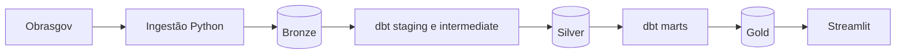

# Inteligência de Obras Públicas para Construção

Case de engenharia de dados da Vertere AI que transforma dados públicos do Obrasgov em inteligência comercial para o setor de construção civil.

> Estado atual: PRD, contexto de domínio e arquitetura definidos. A implementação será adicionada nas próximas etapas.

## Objetivo

Disponibilizar uma visão atualizada das obras públicas de construção no Ceará para apoiar gestores comerciais na análise de mercados, municípios, órgãos responsáveis, investimentos e projetos.

O produto não afirma que uma licitação está aberta e não pretende representar uma lista completa de oportunidades comerciais.

## Recorte

- Fonte: [API pública do Obrasgov](https://api-publica.obrasgov.gestao.gov.br/obras/docs).
- UF principal: Ceará (`CE`).
- Natureza da intervenção: `Obra`.
- Espécie da intervenção: `Construção`.
- Snapshot atual com data da fonte e data da ingestão.
- Situações preservadas conforme os valores originais da fonte.

## Arquitetura



- **Bronze:** dados recebidos da fonte e metadados da execução.
- **Silver:** tipagem, limpeza, deduplicação e integração.
- **Gold:** fatos e dimensões consumidos pelo frontend.
- **Streamlit:** consultas somente leitura, sem regras de negócio duplicadas.

## Stack

- Python, HTTPX e Psycopg.
- uv, `pyproject.toml` e `uv.lock`.
- PostgreSQL.
- dbt Core com `dbt-postgres`.
- Streamlit.
- pytest e Ruff.
- Docker e Docker Compose.
- GitHub Actions para integração contínua.

## Estrutura planejada

```text
ingestion/      pacote e imagem da ingestão
dbt/            projeto de transformação e testes de dados
frontend/       aplicação Streamlit
infra/          bootstrap PostgreSQL
tests/          testes Python e de integração
assets/         marca e referências visuais versionadas
docs/           arquitetura, modelagem e ADRs
specs/          especificações, planos, tarefas e evidências
compose.yaml    execução local completa
pyproject.toml  dependências e ferramentas Python
```

## Indicadores principais

- Total de obras.
- Investimento previsto.
- Municípios alcançados.
- Obras em execução.
- Distribuição por situação original.

## Dashboard

O frontend terá duas visões:

1. Visão geral com KPIs, filtros, distribuições e mapa.
2. Detalhe do projeto com identificação, localização, datas, investimento, execução, contratos, fornecedores e empenhos quando disponíveis.

## Validação preliminar do Ceará

Na consulta exploratória de 18/08/2026, o recorte retornou:

- 3.202 projetos únicos.
- 184 municípios identificados.
- Aproximadamente R$ 25,15 bilhões em investimento previsto.
- 3.192 projetos com geometria.
- 116 projetos com contratos associados.

A baixa cobertura de datas efetivas impede um KPI confiável de atraso.

## Execução alvo

Após a implementação, o ambiente completo será iniciado por Docker Compose:

```bash
docker compose up --build
```

O `compose.yaml` coordenará PostgreSQL, ingestão, dbt e Streamlit por healthchecks e conclusão bem-sucedida das etapas one-shot.

## Documentação

- [PRD](docs/PRD.md)
- [Contexto de domínio](CONTEXT.md)
- [Arquitetura](docs/arquitetura.md)
- [Modelagem de dados](docs/modelagem-dados.md)
- [Glossário de dados](docs/glossario-dados.md)
- [Referências de análises com ObrasGov](docs/referencias-obrasgov.md)
- [Desenvolvimento orientado por especificações](docs/desenvolvimento-spec-driven.md)
- [Ativos visuais](assets/README.md)
- [ADR 0001 — Arquitetura do repositório](docs/adr/0001-arquitetura-do-repositorio.md)
- [ADR 0002 — Modelagem medalhão do ObrasGov](docs/adr/0002-modelagem-medalhao-obrasgov.md)

## Limitações conhecidas

- A fonte não identifica de forma suficiente licitações abertas.
- Não há histórico temporal completo da evolução dos projetos.
- Contratos e datas efetivas possuem cobertura parcial.
- Comparações financeiras devem manter investimento previsto, empenhado, liquidado, pago e contratado como métricas distintas.
