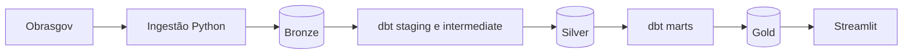

# Inteligência de Obras Públicas para Construção

Case de engenharia de dados da Vertere AI que transforma dados públicos do Obrasgov em inteligência comercial para o setor de construção civil.

> Estado em 23/08/2026: `SPEC-001` e `SPEC-003` **Done**, com aprovação humana registrada; `SPEC-002` permanece **Verifying** até aprovação específica.

## Objetivo

Disponibilizar uma visão atualizada das obras públicas de construção no Ceará para apoiar gestores comerciais na análise de mercados, municípios, órgãos responsáveis, investimentos e projetos.

O produto não afirma que uma licitação está aberta e não pretende representar uma lista completa de oportunidades comerciais.

## Recorte

- Fonte: [API pública do Obrasgov](https://api-publica.obrasgov.gestao.gov.br/obras/docs).
- UF principal: Ceará (`CE`).
- Natureza da intervenção: `Obra`.
- Espécie da intervenção: `Construção`.
- Snapshot atual com data da fonte e data da ingestão.
- Situações preservadas conforme os valores originais da fonte.

## Arquitetura



- **Bronze:** dados recebidos da fonte e metadados da execução.
- **Silver:** tipagem, limpeza, deduplicação e integração.
- **Gold:** fatos e dimensões consumidos pelo frontend.
- **Streamlit:** consultas somente leitura, sem regras de negócio duplicadas.

## Stack

- Python, HTTPX e Psycopg.
- uv, `pyproject.toml` e `uv.lock`.
- PostgreSQL.
- dbt Core com `dbt-postgres`.
- Streamlit.
- pytest e Ruff.
- Docker e Docker Compose.
- Google GenAI e sqlglot para a POC de chat analítico opt-in.

## Estrutura atual

```text
ingestion/      pacote e imagem da ingestão
dbt/            projeto de transformação e testes de dados
frontend/       aplicação Streamlit, detalhe do projeto e chat analítico opcional
infra/          bootstrap e upgrades PostgreSQL
tests/          testes de ingestão, frontend e contratos de integração
assets/         marca e referências visuais versionadas
docs/           arquitetura, modelagem e ADRs
specs/          especificações, planos, tarefas e evidências
compose.yaml    execução local completa
pyproject.toml  dependências e ferramentas Python
```

## Indicadores principais

- Total de obras.
- Investimento previsto.
- Municípios alcançados.
- Obras em execução.
- Distribuição por situação original.

## Aplicação Streamlit

O frontend entrega três páginas:

1. Visão geral com KPIs, filtros de município, organização, situação, área, tipo, subtipo, faixa de investimento, ano e período de cadastro; mapa, distribuição por situação e lista de obras.
2. Detalhe do projeto, sempre para uma obra por `project_id`, com identificação, participantes por papel, localização, contexto, datas, investimento, execução física, contratos, fornecedores, empenhos, estudos, histórico de cancelamento/paralisação e cobertura quando disponíveis.
3. Chat com os dados, opcional e desabilitado por padrão, com consultas somente leitura na Gold.

## Evidência do snapshot

No snapshot atual consultado em 23/08/2026, com `source_updated_at = 2026-08-22T00:00:00Z` e recorte `CE`/`Obra`/`Construção`, foram observados:

- 3.207 projetos.
- 3.246 registros de investimento previsto, totalizando R$ 25.164.016.200,05.
- 5.189 localidades associadas e 193 municípios.
- 698 obras em execução.
- 5.543 associações sem coordenadas, sinalizadas como dados parciais.

Esses números são evidência de um snapshot validado, não valores fixos da aplicação. A baixa cobertura de datas efetivas impede um KPI confiável de atraso. Os comandos e limitações estão nos `verification.md` das specs.

## Execução oficial em containers

Pré-requisitos: Git, Docker Desktop com o engine em execução e acesso à API pública do Obrasgov. Python, uv, dbt e PostgreSQL não precisam ser instalados no host.

No PowerShell, copie o ambiente local e execute o fluxo validado em etapas:

```powershell
Copy-Item .env.example .env
docker compose up -d postgres
docker compose run --rm --build ingestion
docker compose run --rm --no-deps dbt build --project-dir /app/dbt --profiles-dir /app/dbt --target-path /tmp/dbt-target
docker compose up -d --build --no-deps frontend
```

O `compose.yaml` executa PostgreSQL, ingestão, dbt e Streamlit em containers separados. O frontend fica disponível em `http://localhost:8501`. A ingestão nacional usa a API nova, grava Bronze append-only e é idempotente por padrão. A primeira execução pode levar tempo devido ao volume nacional. Um resultado `skipped` na ingestão é sucesso quando o snapshot da fonte não mudou.

O fluxo usa os serviços one-shot (`ingestion` e `dbt`) explicitamente. Por isso, o frontend é iniciado com `--no-deps` depois que o dbt termina: essa ordem é reproduzível em ambiente novo e não depende do estado anterior de containers encerrados. Não use `docker compose up` como substituto desse fluxo.

Em Linux/macOS, substitua `Copy-Item .env.example .env` por `cp .env.example .env`. O `.env.example` contém apenas valores locais de exemplo; troque as senhas antes de compartilhar o ambiente e mantenha `ANALYTICAL_CHAT_ENABLED=false` se o chat não for necessário. Para habilitar o chat, preencha `GEMINI_API_KEY` e altere a flag somente no `.env` local.

Valide a instalação com:

```powershell
docker compose ps
docker compose exec -T postgres pg_isready -U obrasgov_admin -d obrasgov
Invoke-WebRequest http://127.0.0.1:8501/_stcore/health
```

Os bindings publicados são locais: PostgreSQL em `127.0.0.1:5434` e Streamlit em `127.0.0.1:8501`. `docker compose down` preserva o volume; `docker compose down -v` apaga os dados locais e só deve ser usado para reiniciar a instalação.

Em um volume PostgreSQL já existente, aplique os upgrades idempotentes antes do dbt:

```powershell
docker compose cp infra/postgres/upgrade/002_spec_002.sql postgres:/tmp/002_spec_002.sql
docker compose exec -T postgres psql -U obrasgov_admin -d obrasgov -f /tmp/002_spec_002.sql
docker compose cp infra/postgres/upgrade/003_spec_003_chat_gold_grants.sql postgres:/tmp/003_spec_003_chat_gold_grants.sql
docker compose exec -T postgres psql -U obrasgov_admin -d obrasgov -f /tmp/003_spec_003_chat_gold_grants.sql
```

Para forçar nova coleta do mesmo snapshot lógico:

```powershell
docker compose run --rm ingestion --force
docker compose run --rm --no-deps dbt build --project-dir /app/dbt --profiles-dir /app/dbt
```

Não use `docker compose down -v` se quiser preservar os snapshots locais.

## Desenvolvimento e validação

O `.venv` local serve apenas para lint e testes; o runtime oficial continua isolado nos containers:

```powershell
uv sync --locked --all-extras
.venv\Scripts\ruff.exe check .
.venv\Scripts\pytest.exe -p no:cacheprovider -q
```

Para validar o dbt com o ambiente Docker disponível:

```powershell
docker compose run --rm --no-deps dbt build --project-dir /app/dbt --profiles-dir /app/dbt
```

O contrato consultado da API é o [OpenAPI oficial do ObrasGov](https://api-publica.obrasgov.gestao.gov.br/obras/openapi.json). A ingestão integral usa oito recursos, com paginação configurável até 200 itens. Falhas da API, mudanças de `source_updated_at` ou cargas incompletas permanecem auditáveis e não substituem a view `current` publicada.

## Documentação

- [PRD](docs/PRD.md)
- [Contexto de domínio](CONTEXT.md)
- [Arquitetura](docs/arquitetura.md)
- [Modelagem de dados](docs/modelagem-dados.md)
- [Glossário de dados](docs/glossario-dados.md)
- [Referências de análises com ObrasGov](docs/referencias-obrasgov.md)
- [Desenvolvimento orientado por especificações](docs/desenvolvimento-spec-driven.md)
- [Ativos visuais](assets/README.md)
- [ADR 0001 — Arquitetura do repositório](docs/adr/0001-arquitetura-do-repositorio.md)
- [ADR 0002 — Modelagem medalhão do ObrasGov](docs/adr/0002-modelagem-medalhao-obrasgov.md)
- [ADR 0003 — Chat analítico com provider Gemini](docs/adr/0003-chat-analitico-llm-e-sql-seguro.md)
- [Verificação da SPEC-002](specs/002-detalhe-completo-projeto/verification.md)

## Limitações conhecidas

- A fonte não identifica de forma suficiente licitações abertas.
- Não há histórico temporal completo da evolução dos projetos.
- Contratos e datas efetivas possuem cobertura parcial.
- Comparações financeiras devem manter investimento previsto, empenhado, liquidado, pago e contratado como métricas distintas.

## POC de chat analítico com IA

`SPEC-003` está em `Done`, com aprovação registrada em 23/08/2026. A capacidade usa a API Gemini com `gemini-3.5-flash-lite`, desabilitada por padrão, consultando as views Gold públicas dos dashboards por SQL de leitura. CTEs de leitura, joins por `project_id` e agregações são permitidos sob allowlist e controles antifanout; `CREATE TEMP TABLE`, DDL, DML, locks e acesso fora do catálogo não são permitidos. O histórico natural recente é usado para perguntas de acompanhamento, e o spinner “Analisando os dados...” aparece durante o processamento. O Codex CLI fica reservado para uma extensão futura com spec e gate de segurança próprios.

Para habilitar a POC localmente, defina no `.env` `ANALYTICAL_CHAT_ENABLED=true`, `LLM_PROVIDER=gemini`, `GEMINI_MODEL=gemini-3.5-flash-lite` e `GEMINI_API_KEY` fora do Git; `CHAT_PASSWORD` também é obrigatório para o Compose. O executor usa `GOLD_CHAT_DATABASE_URL` com a role dedicada `obrasgov_chat`, transação read-only, timeout e limites de linhas, colunas, células e bytes. A conversa exibe a resposta executiva e, quando houver uma única obra identificada, oferece acesso ao detalhe do projeto. A pergunta, o contexto mínimo, o SQL aprovado e o resultado Gold limitado podem ser enviados ao Gemini; secrets, conexão, schema discovery, `ingestion_id` e payload bruto não são enviados.

O modelo operacional e o fallback do Compose são `gemini-3.5-flash-lite`, validado no fluxo completo. Não há fallback automático para outro provider ou modelo.
