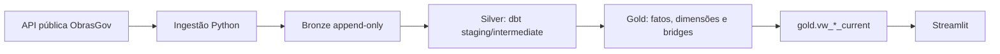

# Guia de apresentação - Obras Públicas — Ceará

## Mensagem central

Este projeto transforma a API pública do ObrasGov em uma visão analítica de obras
públicas de construção no Ceará. A entrega cobre o fluxo completo: ingestão em
Python, persistência Bronze, transformação SQL com dbt, modelagem Gold em fatos,
dimensões e bridges, e consumo em um dashboard Streamlit.

O recorte de negócio é `UF principal = CE`, `natureza = Obra` e `espécie =
Construção`. O produto apoia a análise de mercado, municípios, organizações,
situação e investimento previsto. Não afirma que existe licitação aberta, atraso
ou oportunidade comercial confirmada.

## O que foi entregue



| Camada | Entrega principal | Evidência |
|---|---|---|
| Ingestão | Carga nacional paginada de oito recursos, com retry, idempotência e reconciliação | [`ingestion/`](../ingestion/) |
| Bronze | Payload JSON original, hashes, páginas, timestamps e `ingestion_id`; append-only | [`docs/modelagem-dados.md`](modelagem-dados.md) |
| Silver | Tipagem, limpeza, nulos, deduplicação por ingestão e separação das relações 1:N | [`dbt/models/staging/`](../dbt/models/staging/) e [`dbt/models/intermediate/`](../dbt/models/intermediate/) |
| Gold | 23 tabelas de marts, 18 views `current`, fatos, dimensões e bridges | [`dbt/models/marts/`](../dbt/models/marts/) |
| Aplicação | Visão geral, detalhe por `project_id` e chat analítico opcional | [`frontend/`](../frontend/) |
| Infraestrutura | PostgreSQL, ingestão, dbt e Streamlit em Docker Compose | [`compose.yaml`](../compose.yaml) |

## Como a solução atende aos critérios do case

### 1. Qualidade e organização do código Python e dbt

- O pacote de ingestão separa cliente HTTP, pipeline, persistência PostgreSQL e
  recursos da API.
- O dbt separa `staging`, `intermediate` e `marts`; regras de negócio ficam no
  SQL e não são duplicadas no frontend.
- O frontend consulta somente interfaces Gold allowlisted; não acessa Bronze,
  Silver ou payload raw.
- Dependências e versões estão fixadas em `pyproject.toml` e `uv.lock`.
- Testes automatizados, contratos dbt, testes singulares e documentação de
  verificação acompanham cada incremento.

Evidências registradas: `154 passed`, Ruff sem violações e build dbt sem erros;
os comandos e limitações estão em [`specs/001-pipeline-minimo-ceara/verification.md`](../specs/001-pipeline-minimo-ceara/verification.md),
[`specs/002-detalhe-completo-projeto/verification.md`](../specs/002-detalhe-completo-projeto/verification.md)
e [`specs/003-poc-chat-analitico-ia/verification.md`](../specs/003-poc-chat-analitico-ia/verification.md).

### 2. Coerência da arquitetura medalhão e do star schema

O desenho foi guiado pelas perguntas do dashboard e pela granularidade de cada
recurso da API:

- `fct_project_snapshot`: uma obra por `project_id` e ingestão; é a espinha do
  modelo.
- `fct_planned_investment`: uma obra por fonte de recurso e ingestão.
- `fct_contract`, `fct_commitment`, `fct_physical_execution`,
  `fct_status_event` e `fct_feasibility_study`: fatos independentes, cada um na
  granularidade da fonte.
- Dimensões de organização, intervenção, fonte de recurso, localização,
  fornecedor, PPA e área de restrição.
- Bridges para localizações, pins, participantes, classificações, PPA,
  restrições e indicador de foto.

A decisão principal foi não criar uma tabela única desnormalizada. Juntar
diretamente municípios, fontes de recurso, contratos, empenhos e execução física
causaria fanout e inflaria contagens e valores. Por isso, as relações filhas são
consultadas em views próprias e combinadas somente quando a granularidade é
segura.

As views `gold.vw_*_current` selecionam apenas a última ingestão integral
`succeeded`. Assim, o frontend recebe uma interface estável sem perder os
snapshots anteriores ou as falhas auditáveis na Bronze.

### 3. Qualidade dos dados

| Risco da API | Tratamento adotado |
|---|---|
| Duplicidade dentro da mesma carga | Chaves por ingestão, recurso, página e posição; deduplicação na Silver |
| Nulos e strings vazias | Tipagem no dbt; strings vazias viram nulo; ausência não vira zero |
| Fonte alterada durante a paginação | `source_updated_at` é comparado antes e depois; mudança marca a execução como `failed` |
| Carga incompleta | A execução só vira `succeeded` após reconciliar páginas, itens e os oito recursos |
| Repetição da mesma coleta | Retorna `skipped` por padrão; `--force` cria nova ingestão sem apagar a anterior |
| Fanout financeiro | Investimento previsto, contratos, empenhos e execução permanecem em fatos distintos |
| Identificadores ausentes | Uso de chaves determinísticas e testes de colisão para empenhos e estudos |
| Localização parcial | Pontos sem coordenadas permanecem listados e são sinalizados; não há município principal inferido |
| Situação e datas | Rótulos da fonte são preservados; datas previstas e efetivas ficam separadas |

No snapshot validado com `source_updated_at = 2026-08-22T00:00:00Z`, foram
observados 3.207 projetos, R$ 25.164.016.200,05 em investimento previsto, 193
municípios e 698 obras com situação exatamente igual a `Em execução`. Também
foram sinalizadas 5.543 associações sem coordenadas. Esses números são evidência
de um snapshot, não valores fixos da aplicação.

### 4. Facilidade de execução via Docker

O avaliador precisa apenas de Docker Desktop e acesso à API. PostgreSQL, Python,
dbt, Streamlit e dependências sobem em containers separados, com healthcheck,
roles e schemas criados no bootstrap.

Fluxo documentado no README:

```powershell
Copy-Item .env.example .env
docker compose up -d postgres
docker compose run --rm --build ingestion
docker compose run --rm --no-deps dbt build --project-dir /app/dbt --profiles-dir /app/dbt --target-path /tmp/dbt-target
docker compose up -d --build --no-deps frontend
```

O Compose define o ambiente completo, mas ingestão e dbt são jobs `one-shot`.
Por isso, a execução é ordenada explicitamente para garantir que o banco esteja
saudável, a ingestão termine e o dbt seja concluído antes do frontend. Essa é uma
decisão de reprodutibilidade e observabilidade; é importante explicar que o
checkout não usa um único `docker compose up` como substituto desse fluxo.

### 5. Clareza e relevância dos insights

O dashboard responde diretamente às perguntas de negócio:

| Pergunta | Entrega |
|---|---|
| Onde estão as obras? | Filtros, mapa e contagem de municípios associados |
| Quem concentra os projetos? | Organização responsável e distribuição por município |
| Qual o volume financeiro? | Investimento previsto por projeto e por fonte |
| Qual a situação informada? | Distribuição pelos valores originais da API |
| Quais obras merecem análise individual? | Tabela filtrada e detalhe por `project_id` |

Os KPIs são recalculados com os filtros de município, organização, situação,
tipo, faixa de investimento, ano e período de cadastro. O detalhe abre uma obra
por vez e mostra localização, participantes, investimento, contratos, empenhos,
execução física, estudos e histórico específico quando a fonte fornece esses
dados.

### 6. Capacidade de explicar e justificar decisões técnicas

Mensagens para defender durante a reunião:

- **Por que Bronze nacional e filtro depois?** Para preservar fidelidade da fonte
  e permitir comparação futura sem recarregar a API.
- **Por que snapshots?** A API publica uma fotografia atual; separar por
  `ingestion_id` permite auditoria, comparação futura e isolamento de falhas.
- **Por que `current`?** Simplifica o consumo e garante que o dashboard use uma
  única ingestão completa e válida.
- **Por que não calcular atraso?** A cobertura de datas efetivas não sustenta
  esse KPI sem inventar uma regra ou uma informação que a fonte não fornece.
- **Por que separar investimento previsto, contratado e empenhado?** São medidas
  financeiras diferentes e não podem ser somadas como se fossem a mesma coisa.
- **Por que não inferir licitação, prioridade ou oportunidade?** O dado público
  não contém evidência suficiente para essas conclusões.

## Roteiro curto de demonstração

1. Apresentar o problema e o recorte: obras de construção no Ceará para análise
   de mercado.
2. Mostrar o diagrama API -> Bronze -> Silver -> Gold -> Streamlit.
3. Abrir a visão geral e demonstrar KPIs, filtros, mapa, situação e tabela.
4. Aplicar um filtro de município ou período e mostrar que os KPIs e a lista
   mudam juntos.
5. Abrir uma obra e mostrar que o detalhe preserva relações 1:N sem misturar
   contratos, empenhos e execução.
6. Mostrar rapidamente os arquivos `ingestion/`, `dbt/models/`, `frontend/` e
   `compose.yaml`.
7. Encerrar com qualidade de dados, limitações e evidências de testes.

## Chat analítico com IA - complemento

O chat é uma capacidade opcional, desabilitada por padrão, que demonstra uma
extensão segura sobre a Gold:

```text
pergunta -> Gemini -> SQLGuard AST -> executor PostgreSQL read-only -> Gold limitada -> resposta
```

O Gemini não recebe secrets, conexão, payload raw ou `ingestion_id`. O SQLGuard
aceita apenas `SELECT`/CTE sobre views allowlisted, exige joins seguros por
`project_id`, limita o resultado e bloqueia DDL, DML, locks e fanout. A validação
registrou 13/13 casos no spike do parser e smoke real do fluxo.

Apresentar esse complemento somente depois de explicar o pipeline principal.

## Limitações e evolução

- A API não sustenta afirmações sobre licitação aberta, atraso ou oportunidade
  comercial.
- O histórico atual de situação é o recurso específico de cancelamento/paralisação;
  não é uma série temporal completa entre snapshots.
- Contratos, datas efetivas, coordenadas e fotos têm cobertura parcial.
- Comparação temporal entre snapshots, recorte nacional na aplicação,
  agendamento, retenção da Bronze, autenticação e rate limiting do chat são
  evoluções futuras.
- `uv lock --check` não foi executável no ambiente de validação por ausência do
  binário `uv`; essa limitação está registrada na evidência, sem invalidar os
  testes, lint, Compose e dbt executados.

## Referências para abrir durante a apresentação

- [README e execução local](../README.md)
- [Arquitetura](arquitetura.md)
- [Modelagem de dados](modelagem-dados.md)
- [PRD e perguntas de negócio](PRD.md)
- [ADR da modelagem medalhão](adr/0002-modelagem-medalhao-obrasgov.md)
- [Verificação do pipeline](../specs/001-pipeline-minimo-ceara/verification.md)
- [Verificação do detalhe](../specs/002-detalhe-completo-projeto/verification.md)
- [Verificação do chat](../specs/003-poc-chat-analitico-ia/verification.md)
