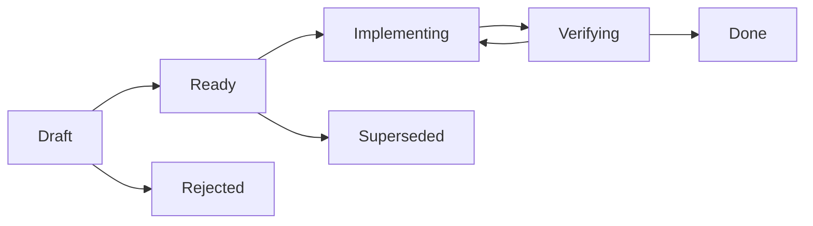

# Desenvolvimento orientado por especificações

**Status:** Aprovado
**Última revisão:** 21/08/2026

## Objetivo

Adotar Spec-Driven Development (SDD) para que cada incremento do projeto seja definido, planejado, implementado e verificado de forma rastreável antes de ser considerado concluído.

Não existe, na documentação oficial consultada, um processo único chamado “Spec-Driven Development do Codex”. Este documento estabelece a convenção do projeto a partir das práticas oficiais de instruções persistentes, contexto explícito, planos rastreáveis e validação concreta.

## Hierarquia documental

Quando houver conflito, prevalece o artefato de maior nível:

1. `docs/PRD.md`: problema, público, escopo e resultado do produto.
2. `CONTEXT.md`: linguagem e conceitos do domínio.
3. `docs/arquitetura.md` e ADRs: decisões estruturais e seus motivos.
4. Spec do incremento: comportamento e critérios de aceitação.
5. Plano e tarefas: forma de implementação da spec.
6. Código e testes: execução verificável das decisões anteriores.

Código existente não redefine silenciosamente um requisito. A documentação correta deve ser atualizada antes ou junto da mudança.

## Unidade de entrega confirmada

Cada pasta em `specs/` representa um incremento pequeno, demonstrável e verificável de ponta a ponta:

```text
specs/
├── README.md
├── _template/
│   ├── spec.md
│   ├── plan.md
│   ├── tasks.md
│   └── verification.md
└── 001-<nome-do-incremento>/
    ├── spec.md
    ├── plan.md
    ├── tasks.md
    └── verification.md
```

Evitar uma única spec para todo o projeto e evitar dividir exclusivamente por camada técnica. A unidade preferida é uma capacidade observável, ainda que atravesse ingestão, dbt, PostgreSQL e Streamlit.

As specs não serão separadas por stack. Quando aplicável, `plan.md` e `tasks.md` agrupam o trabalho por ingestão Python, PostgreSQL/Bronze, dbt Silver/Gold, Streamlit, infraestrutura e testes. A organização do código continua sendo feita pelos módulos de execução definidos na arquitetura.

## Artefatos da spec

### `spec.md` — o que e por quê

Deve conter:

- contexto e resultado esperado;
- escopo e não escopo;
- requisitos identificados como `REQ-NNN`;
- regras de negócio e contratos de dados relevantes;
- critérios de aceitação identificados como `AC-NNN`;
- dependências, riscos e dúvidas materiais;
- status da spec.

Não deve prescrever detalhes internos sem necessidade arquitetural.

### `plan.md` — como

Deve mapear cada requisito para:

- arquivos, APIs, tabelas ou sistemas envolvidos;
- fluxo e transformações de dados;
- tratamento de falhas e idempotência;
- segurança e privacidade;
- estratégia de testes e comandos de validação;
- decisões técnicas ainda abertas.

### `tasks.md` — execução

Deve dividir o plano em tarefas pequenas, ordenadas e marcáveis. Cada tarefa usa `TASK-NNN` e referencia os requisitos ou critérios atendidos. Uma tarefa não substitui requisito nem critério de aceitação.

### `verification.md` — evidência

Deve registrar:

- critério verificado;
- comando ou procedimento executado;
- resultado observado;
- limitações ou verificações não executadas;
- data da verificação.

Somente evidência reproduzível permite concluir a spec.

## Fluxo



- **Draft:** requisitos e dúvidas ainda estão sendo refinados.
- **Ready:** Definition of Ready atendida e implementação autorizada.
- **Implementing:** tarefas em execução; mudanças de requisito voltam primeiro à spec.
- **Verifying:** implementação encerrada e critérios em validação.
- **Done:** critérios aceitos e evidências registradas.
- **Rejected/Superseded:** decisão preservada no histórico, sem exclusão do contexto.

Spikes técnicos são permitidos antes de `Ready` apenas para reduzir incerteza. Seu código não entra no produto sem passar pelo fluxo normal.

## Governança dos estados

| Transição | Responsável |
|---|---|
| Criação e refinamento em `Draft` | Codex e responsável pelo produto |
| `Draft` → `Ready` | Aprovação explícita do responsável pelo produto |
| `Ready` → `Implementing` | Codex após a aprovação |
| `Implementing` → `Verifying` | Codex após concluir as tarefas previstas |
| `Verifying` → `Done` | Aprovação explícita do responsável pelo produto, com evidências |
| Retorno para estado anterior | Codex ou responsável, com motivo registrado |

O Codex não pode inferir aprovação para `Ready` ou `Done` pela ausência de objeções.

## Definition of Ready

Uma spec pode assumir `Ready` quando possui:

- resultado de negócio e usuário beneficiado;
- escopo e não escopo explícitos;
- requisitos e critérios de aceitação testáveis;
- fontes e contratos de dados identificados;
- dependências e riscos conhecidos;
- dúvidas que alterariam materialmente a implementação resolvidas;
- plano revisado e rastreável.

## Definition of Done

Uma spec pode assumir `Done` quando:

- requisitos e critérios possuem evidência correspondente;
- testes relevantes passaram;
- lint, build e smoke test aplicáveis passaram;
- modelos dbt afetados foram construídos e testados;
- documentação e contratos de dados foram atualizados;
- nenhuma regra de negócio foi duplicada no frontend;
- falhas ou validações não executadas foram registradas;
- não existem segredos ou dados sensíveis versionados.

## Uso com Codex

Antes de implementar uma spec, o Codex deve:

1. Ler `AGENTS.md`, PRD, contexto, arquitetura, ADRs aplicáveis e a pasta da spec.
2. Apontar inconsistências ou perguntas que alterem materialmente o resultado.
3. Produzir ou atualizar um plano rastreável aos requisitos.
4. Executar somente tarefas previstas ou registrar a mudança na spec.
5. Rodar a validação mais relevante disponível.
6. Registrar evidências e não declarar conclusão sem verificação.

As regras permanentes e concisas serão mantidas em `AGENTS.md`. Detalhes extensos permanecem nesta documentação e nas specs, evitando ultrapassar o contexto útil das instruções do agente.

## Política de mudança

- Mudança de produto: atualizar o PRD.
- Mudança de linguagem do domínio: atualizar `CONTEXT.md`.
- Decisão arquitetural relevante: criar ou substituir ADR.
- Mudança de comportamento de um incremento: atualizar sua spec antes do código.
- Ajuste exclusivamente interno, sem alterar comportamento ou arquitetura: atualizar plano e tarefas.
- Uma spec concluída não é reescrita para apagar histórico; uma mudança material cria nova spec e referencia a anterior.

### Quando uma spec é obrigatória

Uma spec é obrigatória para mudanças em:

- comportamento funcional;
- contratos, fontes ou fluxo de dados;
- modelagem analítica;
- arquitetura ou interfaces entre módulos;
- ingestão e transformação;
- KPIs, filtros ou comportamento do frontend.

Correções textuais, formatação e refatorações mecânicas comprovadamente sem mudança de comportamento estão dispensadas. A dispensa não elimina testes, revisão ou atualização de documentação afetada.

## Versionamento durante o desenvolvimento individual

Enquanto houver apenas um desenvolvedor no repositório, pull requests não são obrigatórios. A rastreabilidade do SDD deve permanecer nos artefatos da spec e no histórico Git. Se outras pessoas passarem a contribuir, o fluxo será reavaliado antes de tornar revisão por pull request obrigatória.

O desenvolvimento ocorrerá diretamente na `main`, com commits pequenos e coerentes. Commits relacionados a uma spec devem seguir Conventional Commits e usar seu identificador como escopo:

```text
feat(spec-001): ingest projects
test(spec-001): validate bronze load
docs(spec-001): record verification evidence
```

Cada commit deve manter o repositório em estado verificável ou declarar claramente quando fizer parte de uma sequência ainda incompleta.

## Sequência inicial confirmada

1. `SPEC-001` — pipeline mínimo de projetos do Ceará: fundação necessária + Obrasgov → Bronze → Silver/Gold → Streamlit.
2. Enriquecimento com execução, contratos, fornecedores e empenhos conforme cobertura da API.
3. Visão geral e detalhe comercial completos.
4. Qualidade, observabilidade e integração contínua do pipeline completo.

A primeira fatia funcional deve entregar valor demonstrável antes da expansão da cobertura.

## Referências oficiais

- [OpenAI — orientação de modelo: planos rastreáveis e validação](https://developers.openai.com/api/docs/guides/latest-model?model=gpt-5.5)
- [OpenAI — instruções personalizadas com AGENTS.md](https://learn.chatgpt.com/docs/agent-configuration/agents-md)
- [OpenAI — prompting: objetivo, contexto, saída e limites](https://learn.chatgpt.com/docs/prompting)
