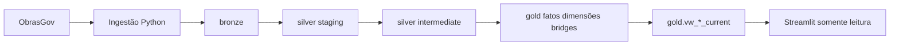

# Modelagem de dados — SPEC-001

**Status:** Implementação em verificação
**Última revisão:** 22/08/2026
**Fonte de requisitos:** [`PRD.md`](PRD.md) e [`specs/001-pipeline-minimo-ceara/spec.md`](../specs/001-pipeline-minimo-ceara/spec.md)

## 1. Objetivo e recorte

A SPEC-001 coleta um snapshot nacional do ObrasGov e publica uma visão analítica das obras de construção no Ceará.

- A Bronze recebe nacionalmente `/data-atualizacao`, `/projeto-investimento` e `/geometria`.
- A Silver tipa, normaliza, deduplica dentro de cada ingestão e separa relações multivaloradas.
- A Gold aplica `uf_principal = CE`, `natureza_intervencao = Obra` e `especie_intervencao = Construção`.
- O Streamlit consulta somente views Gold atuais, em modo somente leitura.
- `ingestion_id`, `source_updated_at` e `ingested_at` são mecanismos internos de rastreabilidade; não são indicadores de negócio.

Para o consumo executivo, uma linha de projeto representa uma obra observada no recorte atual. Localizações, classificações e fontes de recurso podem ter mais de um registro e não devem multiplicar a obra nem seus valores.

## 2. Fluxo e fronteiras

O dbt define o recorte, as granularidades e as views Gold. O frontend aplica as seleções do usuário e solicita agregações SQL sobre essas views para os KPIs filtrados; não lê payload bruto nem tabelas históricas.

## 3. Contrato Bronze

### 3.1 Execução e publicação

`bronze.ingestion_run` registra uma tentativa por `ingestion_id`:

| Campo | Significado interno |
|---|---|
| `ingestion_id` | Identificador imutável da execução. |
| `started_at` / `finished_at` | Início e término da tentativa. |
| `status` | `running`, `succeeded`, `failed` ou `skipped`. |
| `source_updated_at` | Data/hora informada por `/data-atualizacao`. |
| `base_url` | API consultada. |
| `query_scope` / `scope_hash` | Recursos e parâmetros que formam a identidade lógica do snapshot. |
| `force_requested` | Indica reprocessamento explícito com `--force`. |
| `error_message` | Evidência da falha, quando houver. |

Uma execução só recebe `succeeded` depois de carregar os três recursos, reconciliar todas as páginas e confirmar que `source_updated_at` não mudou durante a coleta. Execuções falhas permanecem auditáveis e nunca se tornam atuais.

Uma repetição do mesmo snapshot lógico é `skipped` por padrão. `--force` cria outro `ingestion_id`; nenhum snapshot anterior é apagado.

### 3.2 Recursos e payloads

Cada execução controla os recursos em `bronze.ingestion_resource` e as páginas em `bronze.ingestion_page`. Os payloads originais ficam em:

- `bronze.obrasgov_source_update_raw` — resposta de atualização da fonte;
- `bronze.obrasgov_project_raw` — projetos de investimento;
- `bronze.obrasgov_geometry_raw` — associações territoriais.

As tabelas raw compartilham `ingestion_id`, `page_number`, `page_size`, `record_index`, `payload`, `record_hash` e `fetched_at`. A chave `(ingestion_id, page_number, record_index)` impede duplicação acidental de uma página dentro da mesma execução.

O `payload` não é renomeado nem filtrado na Bronze. A carga é nacional; o filtro do Ceará existe apenas a partir da Gold.

## 4. Contrato Silver

### 4.1 Staging

| Modelo | Granularidade e significado |
|---|---|
| `stg_obrasgov_ingestion_run` | Uma execução tipada; `ingested_at` corresponde ao término registrado em `finished_at`. |
| `stg_obrasgov_project` | Um projeto observado por `ingestion_id`, com campos tipados, nomes analíticos em inglês e coleções aninhadas preservadas para explosão. |
| `stg_obrasgov_geometry` | Uma geometria observada por `ingestion_id`, com projeto, município, código IBGE, UF e origem da geometria. |

O projeto é deduplicado somente dentro da mesma ingestão. Versões do mesmo projeto em ingestões diferentes permanecem como snapshots distintos. A Silver converte datas, valores numéricos e coordenadas; string vazia vira nulo e ausência não vira zero.

### 4.2 Intermediate

| Modelo | Granularidade e significado |
|---|---|
| `int_obrasgov_current_ingestion` | A última execução `succeeded`; serve para todas as views atuais. |
| `int_obrasgov_project_investment` | Um item de `investimentos_previstos` por projeto, fonte e posição na coleção. |
| `int_obrasgov_project_axis_type` | Uma combinação de eixo, tipo e subtipo por projeto e posição. |
| `int_obrasgov_project_pin` | Um pin de latitude/longitude por projeto e posição. |

As coleções são explodidas separadamente. Assim, vários municípios, fontes de recurso, classificações ou pins não geram produto cartesiano nem inflacionam valores financeiros.

## 5. Contrato Gold

### 5.1 Fatos, dimensões e bridges

| Objeto | Granularidade | Significado para o negócio |
|---|---|---|
| `fct_project_snapshot` | Projeto por `ingestion_id` no recorte do Ceará | A obra e seus atributos observados naquela atualização: nome, organização, situação, classificações, datas e indicadores disponíveis. |
| `fct_planned_investment` | Projeto, fonte de recurso e `ingestion_id` | Valor previsto por fonte; registros da mesma fonte são somados dentro do projeto após a preservação da contagem de origem. |
| `dim_organization` | Organização responsável observada | Órgão ou entidade responsável informado pela fonte. |
| `dim_intervention` | Natureza e espécie da intervenção | Classificação original que sustenta o recorte `Obra`/`Construção`. |
| `dim_funding_source` | Fonte de recurso | Origem informada para o investimento previsto. |
| `dim_axis_type` | Eixo, tipo e subtipo | Classificações temáticas originais da obra. |
| `dim_location` | Geometria municipal por ingestão | Município, código IBGE, UF e origem da associação territorial. |
| `dim_pin` | Pin por ingestão | Coordenada pontual recebida da fonte, separada da associação municipal. |
| `bridge_project_axis_type` | Projeto e classificação | Relação multivalorada sem repetir medidas do projeto. |
| `bridge_project_location` | Projeto e município/geometria | Relação territorial sem agregar investimento por município. |
| `bridge_project_pin` | Projeto e pin | Relação entre a obra e suas coordenadas. |

Os fatos preservam `ingestion_id`, `source_updated_at` e `ingested_at`; as bridges preservam `ingestion_id` para manter a versão observada. Esses identificadores permitem auditoria e comparação entre snapshots, mas não criam histórico de situações que a API não forneceu.

### 5.2 Recorte e situação

O recorte é aplicado em `fct_project_snapshot`. `source_status` mantém o valor original de `situacao`; a Gold não reclassifica uma obra como oportunidade, risco, atraso ou prioridade. `Em execução` é contado somente quando esse texto original coincide exatamente.

## 6. Views Gold atuais

Todas as views abaixo usam exclusivamente a última execução `succeeded`, identificada internamente por `int_obrasgov_current_ingestion`. O Streamlit não recebe a mecânica de seleção de snapshot como regra de negócio.

| View | Granularidade e uso |
|---|---|
| `gold.vw_market_overview_current` | Uma linha por projeto. Alimenta filtros, lista de obras e o valor previsto total por projeto; expõe identificação, organização, situação, eixo/tipo/subtipo, datas de cadastro, datas previstas e municípios agregados. |
| `gold.vw_project_investment_current` | Uma linha por projeto e fonte de recurso. Disponibiliza a abertura do investimento previsto por fonte no adaptador Gold; a página de detalhe ainda é uma etapa futura. |
| `gold.vw_project_location_current` | Uma linha por projeto e município, com código IBGE, UF, latitude, longitude e valor previsto do projeto. Alimenta mapa e filtro de município. |
| `gold.vw_status_distribution_current` | Uma linha por situação original e quantidade de projetos. Alimenta a distribuição inicial da visão geral. |
| `gold.vw_snapshot_metadata_current` | Uma linha com a execução atual, datas de referência/coleta e contagens agregadas. Alimenta o contexto do painel e os KPIs do snapshot sem exibir `ingestion_id` ao público. |

O adaptador do Streamlit mantém uma lista permitida dessas cinco views. A visão geral consulta diretamente as views de metadados, mercado e localização; a distribuição inicial usa `vw_status_distribution_current`, enquanto a distribuição após filtros é recalculada sobre a view de mercado. A view de investimento está disponível para a abertura por fonte, mas não é usada pela página de detalhe atual.

## 7. Regras de dados para consumo executivo

### 7.1 Localização e coordenadas

Município é a associação territorial informada pela geometria e contado pelo código IBGE. Uma obra pode estar associada a mais de um município; por isso municípios alcançados e total de obras são indicadores diferentes.

Latitude e longitude vêm dos pins, não da geometria municipal. A view publica coordenadas somente quando existe exatamente um par distinto de latitude/longitude não nulo para o projeto. Pins ausentes ou múltiplos pares tornam a coordenada nula para evitar escolher uma localização arbitrária.

O valor previsto aparece repetido em cada município da view de localização apenas para contexto. Não se deve somar esse campo por município; para investimento, usar a visão por projeto ou por fonte.

### 7.2 Investimento previsto

`planned_investment_amount` é a soma dos registros de `investimentos_previstos` por projeto e fonte de recurso. É uma estimativa informada pela fonte, não representa contrato, empenho, liquidação ou pagamento.

O total do painel soma uma vez o valor agregado de cada projeto. A abertura por fonte usa `vw_project_investment_current`. Valores nulos permanecem nulos e não são convertidos em zero sem regra explícita.

### 7.3 Situação

A situação exibida é o texto original da API. A distribuição conta projetos por esse valor, sem agrupar categorias ou inferir estágio comercial. A situação não é histórico: snapshots antigos permitem auditoria, mas o pipeline atual não cria uma linha de evolução entre eles.

### 7.4 Datas de cadastro e execução

- `registration_date` vem de `dt_cadastro` e `registration_year` de `ano_cadastro`.
- O filtro de período usa `registration_date` e é ancorado em `source_updated_at` do snapshot atual, não na data do computador.
- As opções são `Sem filtro`, `Último mês`, `Últimos 3 meses`, `Últimos 6 meses`, `Últimos 12 meses` e `Ano corrente`.
- `expected_start_date` e `expected_end_date` são datas previstas da fonte.
- `actual_start_date` e `actual_end_date` existem no fato de snapshot, mas a visão geral atual não os expõe.
- Datas nulas ficam fora de um período de cadastro selecionado.

## 8. KPIs

Os KPIs da visão geral são recalculados para o conjunto de obras depois dos filtros selecionados.

| KPI | Regra | Leitura executiva |
|---|---|---|
| Total de obras | `count(distinct project_id)` em `vw_market_overview_current` | Quantidade de projetos de investimento no recorte selecionado. |
| Investimento previsto | Soma de `planned_investment_amount` uma vez por projeto | Volume financeiro estimado para as obras selecionadas. |
| Municípios alcançados | `count(distinct ibge_code)` em `vw_project_location_current` | Quantidade de municípios associados às obras selecionadas. |
| Obras em execução | Projetos com `source_status = 'Em execução'` | Quantidade cujo registro oficial informa esse status. |
| Distribuição por situação | Contagem de projetos por `source_status` | Como as obras estão distribuídas nas categorias originais da fonte. |

Não há KPI de atraso. Investimento previsto, valor contratado, empenhado, liquidado e pago são grandezas diferentes e não podem ser somados em uma única métrica.

## 9. Limitações conhecidas

- O pipeline atual ingere somente os três recursos da SPEC-001. Contratos, fornecedores, empenhos, execução física, histórico de situação e estudos de viabilidade não fazem parte deste contrato.
- O snapshot é uma fotografia da fonte. A retenção de `ingestion_id` permite auditoria entre cargas, mas não substitui um histórico de eventos fornecido pela API.
- A Gold publica apenas `CE` + `Obra` + `Construção`; a Bronze é nacional, mas não é uma visão nacional no frontend.
- Geometrias municipais podem existir sem coordenadas utilizáveis; múltiplos pins distintos também deixam a coordenada nula. O painel sinaliza dados parciais quando isso reduz a cobertura do mapa.
- A cobertura de datas efetivas é baixa no recorte validado, portanto não há base confiável para calcular atraso.
- O endpoint público pode mudar, falhar ou alterar a cobertura. Uma execução incompleta ou com mudança de `source_updated_at` permanece como falha e não altera a view atual.
- A atualização é local e sob demanda na SPEC-001; agendamento e operação em nuvem estão fora do escopo.

## 10. Evidência de validação

Os contratos são descritos nos YAMLs dbt e testados no fluxo da SPEC-001. A verificação registrada em [`specs/001-pipeline-minimo-ceara/verification.md`](../specs/001-pipeline-minimo-ceara/verification.md) reporta `dbt build` com 153/153 modelos/testes, reconciliação Silver/Gold aprovada, views atuais isoladas pela última execução `succeeded` e testes do Streamlit com dados Gold reais.
