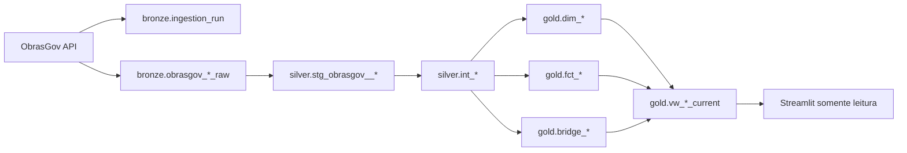

# Modelagem de dados — ObrasGov

**Status:** Proposta para implementação
**Última revisão:** 21/08/2026
**Fonte de requisitos:** [`PRD.md`](PRD.md)

## 1. Objetivo e recorte

Esta modelagem transforma o snapshot nacional da API pública do ObrasGov em dados analíticos para inteligência comercial de obras públicas de construção no Ceará.

- A Bronze ingere todos os recursos nacionais sem filtro de negócio.
- A Silver tipa, normaliza, deduplica e separa relações multivaloradas.
- A Gold aplica o recorte `uf_principal = CE`, `natureza_intervencao = Obra` e `especie_intervencao = Construção` nos modelos de consumo do case.
- Cada linha publicada mantém `ingestion_id`, `source_updated_at` e `ingested_at` para distinguir o momento informado pela fonte do momento de coleta.
- Situações e métricas financeiras permanecem fiéis à API; não há classificação comercial automática nem soma entre grandezas financeiras diferentes.

## 2. Contrato da fonte

Base atual: `https://api-publica.obrasgov.gestao.gov.br/obras`.

| Recurso | Endpoint | Conteúdo principal | Cardinalidade esperada |
|---|---|---|---|
| atualização | `/data-atualizacao` | data de atualização da fonte | 1 por consulta |
| projetos | `/projeto-investimento` | projeto e relações aninhadas | 1 por projeto |
| empenhos | `/empenho` | execução orçamentária e financeira | N por projeto |
| execução física | `/execucao-fisica` | percentual, datas, indicativos e motivos | N por projeto |
| contratos | `/contrato` | contrato e fornecedor | N por projeto |
| geometrias | `/geometria` | município e identificadores territoriais | N por projeto |
| histórico de situação | `/historico-situacao-cancelada-paralisada` | eventos de cancelamento ou paralisação | N por projeto |
| estudos de viabilidade | `/estudo-viabilidade` | tipo e especificação do estudo | N por projeto |

O recurso de projetos também contém as coleções `repassadores`, `tomadores`, `executores`, `investimentos_previstos`, `ppas`, `eixos_tipos`, `fotos`, `pins` e `areas_restricao`.

## 3. Fluxo e fronteiras

O frontend consulta apenas `gold`. Relações N:N são publicadas em bridges; fatos não devem ser unidos diretamente entre si.

## 4. Bronze — preservação e rastreabilidade

### 4.1 `bronze.ingestion_run`

Uma linha por execução completa do pipeline.

| Coluna | Tipo | Regra |
|---|---|---|
| `ingestion_id` | `uuid` | chave primária |
| `started_at` | `timestamptz` | obrigatório |
| `finished_at` | `timestamptz` | nulo enquanto em execução |
| `status` | `text` | `running`, `succeeded` ou `failed` |
| `source_updated_at` | `timestamptz` | valor de `/data-atualizacao` |
| `base_url` | `text` | URL da API consultada |
| `query_scope` | `jsonb` | consulta nacional e parâmetros técnicos |
| `error_message` | `text` | preenchido somente em falha |

### 4.2 Tabelas raw

Uma tabela por recurso paginado:

- `bronze.obrasgov_project_raw`
- `bronze.obrasgov_commitment_raw`
- `bronze.obrasgov_physical_execution_raw`
- `bronze.obrasgov_contract_raw`
- `bronze.obrasgov_geometry_raw`
- `bronze.obrasgov_status_history_raw`
- `bronze.obrasgov_feasibility_study_raw`

Contrato comum:

| Coluna | Tipo | Regra |
|---|---|---|
| `ingestion_id` | `uuid` | FK lógica para `ingestion_run` |
| `page_number` | `integer` | página devolvida pela API |
| `page_size` | `integer` | tamanho solicitado |
| `record_index` | `integer` | posição do registro na página |
| `payload` | `jsonb` | registro recebido sem renomeação |
| `record_hash` | `text` | SHA-256 do JSON canônico |
| `fetched_at` | `timestamptz` | instante da resposta |

Chave física: `(ingestion_id, page_number, record_index)`. A Bronze é append-only. `record_hash` apoia auditoria, mas não substitui a identidade de negócio.

Critério de carga completa: a soma dos registros persistidos deve coincidir com `total_items`, todas as páginas de `1` a `total_pages` devem existir e `page_number` devolvido deve corresponder ao solicitado.

## 5. Silver — normalização por granularidade

### 5.1 Staging dos recursos

| Modelo | Granularidade | Chave de deduplicação por ingestão |
|---|---|---|
| `stg_obrasgov__project` | projeto observado | `id_projeto_investimento` |
| `stg_obrasgov__commitment` | registro de empenho observado | chave composta documentada abaixo |
| `stg_obrasgov__physical_execution` | execução física observada | projeto + `id_execucao_fisica` |
| `stg_obrasgov__contract` | contrato observado | projeto + `id_contrato` |
| `stg_obrasgov__geometry` | associação territorial observada | projeto + `id_geometria` |
| `stg_obrasgov__status_history` | evento de situação observado | projeto + `id_historico_situacao_investimento` |
| `stg_obrasgov__feasibility_study` | estudo observado | projeto + tipo + hash da especificação |

Quando a API não fornece identificador estável, a chave técnica é um hash determinístico dos campos de identidade disponíveis. Para empenhos:

`project_id + source_system + source_database + issuing_unit + commitment_number + draft_id + issue_date`

Se essa composição ainda colidir, `record_hash` diferencia os registros e um teste registra a ocorrência. Não se deve inventar unicidade descartando linhas silenciosamente.

### 5.2 Relações aninhadas do projeto

Cada coleção é explodida isoladamente, sempre mantendo `project_id`, `ingestion_id` e `item_index`:

| Modelo | Granularidade |
|---|---|
| `stg_obrasgov__project_transferor` | projeto e organização repassadora |
| `stg_obrasgov__project_recipient` | projeto e organização tomadora |
| `stg_obrasgov__project_executor` | projeto e organização executora |
| `stg_obrasgov__planned_investment` | projeto e registro de fonte de recurso |
| `stg_obrasgov__project_ppa` | projeto e PPA |
| `stg_obrasgov__project_intervention` | projeto e eixo/tipo/subtipo |
| `stg_obrasgov__project_photo` | projeto e indicador de foto |
| `stg_obrasgov__project_pin` | projeto e coordenada |
| `stg_obrasgov__project_restriction_area` | projeto e área de restrição |
| `stg_obrasgov__execution_indicator` | execução física e indicativo |
| `stg_obrasgov__execution_reason` | execução física e motivo |

Explodir coleções em modelos separados evita produtos cartesianos. Por exemplo, dois executores e três fontes de recurso não podem gerar seis investimentos.

### 5.3 Padronizações

- Renomear campos para inglês apenas nos modelos dbt; a Bronze preserva nomes da API.
- Converter datas ISO para `date` e instantes para `timestamptz`.
- Converter valores monetários para `numeric(20,2)` e percentuais para `numeric(7,4)`.
- Preservar CNPJ como texto com 14 dígitos; nunca como número.
- Converter latitude e longitude para `numeric(10,7)` e validar limites geográficos.
- Tratar string vazia como nulo, sem transformar ausência em zero.
- Manter `situacao` original; qualquer rótulo de apresentação pertence à Gold e deve preservar o valor-fonte.
- Deduplicar apenas cópias exatas dentro da mesma ingestão. Mudanças entre ingestões constituem novos snapshots.

## 6. Gold — modelo dimensional

### 6.1 Diagrama lógico

```mermaid
erDiagram
    DIM_PROJECT ||--o{ FCT_PROJECT_SNAPSHOT : descreve
    DIM_ORGANIZATION ||--o{ FCT_PROJECT_SNAPSHOT : responsavel
    DIM_STATUS ||--o{ FCT_PROJECT_SNAPSHOT : situacao
    DIM_INTERVENTION ||--o{ FCT_PROJECT_SNAPSHOT : classifica
    DIM_PROJECT ||--o{ FCT_PLANNED_INVESTMENT : recebe
    DIM_FUNDING_SOURCE ||--o{ FCT_PLANNED_INVESTMENT : financia
    DIM_PROJECT ||--o{ FCT_CONTRACT : possui
    DIM_SUPPLIER ||--o{ FCT_CONTRACT : fornece
    DIM_PROJECT ||--o{ FCT_COMMITMENT : possui
    DIM_PROJECT ||--o{ FCT_PHYSICAL_EXECUTION : acompanha
    DIM_PROJECT ||--o{ FCT_STATUS_EVENT : historico
    DIM_PROJECT ||--o{ BRIDGE_PROJECT_LOCATION : localiza
    DIM_LOCATION ||--o{ BRIDGE_PROJECT_LOCATION : territorio
    DIM_PROJECT ||--o{ BRIDGE_PROJECT_ORGANIZATION : participa
    DIM_ORGANIZATION ||--o{ BRIDGE_PROJECT_ORGANIZATION : atua
```

`dim_date` é uma dimensão conformada usada por papéis como cadastro, início previsto, emissão, assinatura e atualização.

### 6.2 Dimensões

| Modelo | Chave substituta | Chave natural e conteúdo |
|---|---|---|
| `dim_project` | `project_sk` | `project_id`; nome e descrição estáveis para navegação |
| `dim_organization` | `organization_sk` | CNPJ; fallback por nome normalizado quando ausente |
| `dim_supplier` | `supplier_sk` | CNPJ do fornecedor; fallback por nome normalizado |
| `dim_location` | `location_sk` | `cod_ibge`; município e UF |
| `dim_intervention` | `intervention_sk` | IDs de eixo, tipo e subtipo; descrições originais |
| `dim_status` | `status_sk` | valor original de `situacao` |
| `dim_funding_source` | `funding_source_sk` | nome original da fonte de recurso |
| `dim_date` | `date_sk` | data calendário no formato `YYYYMMDD` |

As dimensões usam chave substituta por hash determinístico. O histórico de atributos mutáveis fica nos fatos snapshot; não é necessário SCD tipo 2 no primeiro incremento.

### 6.3 Fatos e bridges

| Modelo | Granularidade | Medidas principais |
|---|---|---|
| `fct_project_snapshot` | projeto por ingestão | beneficiários, empregos, indicador BIM, datas e contadores de cobertura |
| `fct_planned_investment` | projeto, fonte de recurso e ingestão | `planned_investment_amount` |
| `fct_contract` | projeto, contrato e ingestão | global, acumulado, utilizado no projeto e incluído |
| `fct_commitment` | projeto, empenho e ingestão | empenhado, a liquidar, liquidado, pago e restos a pagar |
| `fct_physical_execution` | projeto, execução física e ingestão | percentual de execução e datas |
| `fct_status_event` | projeto, evento e ingestão | evento sem medida aditiva |
| `fct_feasibility_study` | projeto, estudo e ingestão | estudo sem medida aditiva |
| `bridge_project_location` | projeto, município e ingestão | associação sem medida |
| `bridge_project_pin` | projeto, coordenada e ingestão | latitude e longitude |
| `bridge_project_organization` | projeto, organização, papel e ingestão | papel: responsável, repassador, tomador ou executor |

Em `fct_planned_investment`, registros repetidos da mesma fonte dentro do projeto e ingestão são agregados somente após teste de duplicidade e preservação da contagem de origem. Isso garante uma linha por fonte sem perder reconciliação.

### 6.4 Views de consumo atual

As views `gold.vw_*_current` selecionam a última ingestão `succeeded` e escondem a mecânica de snapshot do Streamlit:

- `vw_market_overview_current`: base de projetos para KPIs e filtros.
- `vw_project_investment_current`: investimento por projeto e fonte.
- `vw_project_location_current`: municípios e coordenadas do mapa.
- `vw_project_detail_current`: atributos do projeto sem joins N:N.
- `vw_project_contract_current`, `vw_project_commitment_current` e `vw_project_execution_current`: seções do detalhe.

## 7. Regras dos KPIs

Todos os KPIs usam apenas a última ingestão completa e o recorte do case.

| KPI | Regra |
|---|---|
| Total de obras | `count(distinct project_id)` em `vw_market_overview_current` |
| Investimento previsto | soma de `planned_investment_amount` em `vw_project_investment_current` |
| Municípios alcançados | `count(distinct ibge_code)` em `vw_project_location_current` |
| Obras em execução | projetos distintos com `source_status = 'Em execução'` |
| Distribuição por situação | projetos distintos agrupados pelo valor original de `source_status` |

Não somar investimento previsto, valor contratado, empenhado, liquidado e pago em uma única métrica. Para projetos em mais de um município, a contagem por município não é aditiva ao total de projetos.

## 8. Qualidade e aceite

### Erros bloqueantes

- execução sem todas as páginas ou com divergência de `total_items`;
- `project_id` nulo na entidade projeto;
- duplicidade da chave declarada em dimensões ou fatos após deduplicação;
- filho sem projeto correspondente na mesma ingestão completa;
- valor fora de `0..100` para percentual de execução;
- latitude fora de `-90..90` ou longitude fora de `-180..180`;
- ingestão publicada como atual sem status `succeeded`.

### Alertas de qualidade

- nova situação não conhecida, sem impedir sua preservação;
- CNPJ presente fora do formato de 14 dígitos;
- valor financeiro negativo;
- queda relevante de cobertura de contratos, geometrias ou datas;
- diferença entre `source_updated_at` e `ingested_at` acima do SLA definido.

### Reconciliações mínimas

- Bronze versus `total_items` por endpoint e ingestão.
- Silver versus Bronze após separar duplicatas exatas.
- Gold versus Silver para contagem de projetos no recorte.
- soma do investimento previsto por projeto e fonte antes e depois da Gold.
- ausência de fanout ao combinar projeto, localização, organização e investimento.

## 9. Decisões pendentes

1. Frequência e SLA de atualização do snapshot.
2. Política de retenção das ingestões Bronze.
3. Comportamento quando a API muda durante uma execução nacional.
4. Critério definitivo para colisões de empenhos sem identificador único.
5. Extensão da comparação nacional no frontend.

Essas decisões não impedem a primeira fatia do Ceará, mas devem ser resolvidas antes de marcar a spec de ingestão como `Ready`.

## 10. Referências

- [Documentação OpenAPI atual do ObrasGov](https://api-publica.obrasgov.gestao.gov.br/obras/docs)
- [API de Dados Abertos ObrasGov — anúncio oficial](https://www.gov.br/obrasgov/pt-br/ferramentas-de-gestao-e-transparencia/api-de-dados-abertos-obrasgov-br_novo)
- [Análises e implementações públicas consultadas](referencias-obrasgov.md)
- [ADR 0002 — modelagem medalhão](adr/0002-modelagem-medalhao-obrasgov.md)
