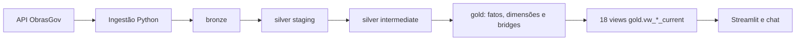

# Modelagem de dados — ObrasGov

**Estado:** SPEC-001, SPEC-002 e SPEC-003 concluídas (`Done`)
**Última revisão:** 23/08/2026
**Fontes de requisitos:** [`docs/PRD.md`](PRD.md), [`CONTEXT.md`](../CONTEXT.md) e as
specs [`001`](../specs/001-pipeline-minimo-ceara/spec.md),
[`002`](../specs/002-detalhe-completo-projeto/spec.md) e
[`003`](../specs/003-poc-chat-analitico-ia/spec.md)

## 1. Capacidade entregue

A ingestão coleta um snapshot nacional; a Gold publica o recorte de projetos com:

```text
uf_principal = CE
natureza_intervencao = Obra
especie_intervencao = Construção
```

O pipeline atual trata oito recursos no mesmo snapshot lógico:
`data-atualizacao`, `projeto-investimento`, `geometria`, `contrato`, `empenho`,
`execucao-fisica`, `historico-situacao-cancelada-paralisada` e
`estudo-viabilidade`. A visão geral, o detalhe e o chat consomem somente as views
Gold da última ingestão integral `succeeded`.

Uma linha não representa sempre um projeto: fatos e relações multivaloradas mantêm
suas próprias granularidades. Essa separação evita fanout e impede somar investimento
previsto a partir de linhas de municípios, contratos ou empenhos.

## 2. Fluxo e seleção do snapshot atual



`int_obrasgov_current_ingestion` seleciona a última execução que:

- possui status `succeeded`;
- tem os oito recursos registrados como `succeeded`;
- é mais recente por `ingested_at`, com desempates por `source_updated_at` e
  `ingestion_id`.

As views `current` escondem essa mecânica do frontend. Snapshots anteriores,
falhos e `skipped` permanecem na Bronze para auditoria, mas não são publicados nas
interfaces atuais.

## 3. Bronze

### 3.1 Execução

`bronze.ingestion_run` registra `ingestion_id`, `started_at`, `finished_at`,
`status`, `source_updated_at`, `base_url`, `query_scope`, `scope_hash`,
`force_requested` e `error_message`.

Estados possíveis: `running`, `succeeded`, `failed` e `skipped`. A publicação exige
reconciliação de páginas/itens dos oito recursos e confirmação de que a fonte não
mudou durante a coleta. Repetição do mesmo snapshot é `skipped` por padrão; `--force`
cria outro `ingestion_id` sem apagar o anterior.

`bronze.ingestion_resource` registra endpoint, totais, páginas/itens recebidos e
status. `bronze.ingestion_page` registra os metadados de cada página.

### 3.2 Payloads raw

| Recurso | Tabela Bronze |
|---|---|
| `data-atualizacao` | `bronze.obrasgov_source_update_raw` |
| `projeto-investimento` | `bronze.obrasgov_project_raw` |
| `geometria` | `bronze.obrasgov_geometry_raw` |
| `contrato` | `bronze.obrasgov_contract_raw` |
| `empenho` | `bronze.obrasgov_commitment_raw` |
| `execucao-fisica` | `bronze.obrasgov_physical_execution_raw` |
| `historico-situacao-cancelada-paralisada` | `bronze.obrasgov_status_history_raw` |
| `estudo-viabilidade` | `bronze.obrasgov_feasibility_study_raw` |

As tabelas raw preservam `ingestion_id`, página, posição, `payload`, `record_hash`
e `fetched_at`. A chave `(ingestion_id, page_number, record_index)` evita
duplicação acidental na persistência; o payload não é renomeado nem filtrado.

## 4. Silver

### 4.1 Staging

| Modelo | Granularidade |
|---|---|
| `stg_obrasgov_ingestion_run` | uma execução tipada |
| `stg_obrasgov_project` | projeto por ingestão, com coleções aninhadas preservadas |
| `stg_obrasgov_geometry` | registro de geometria por ingestão |
| `stg_obrasgov_contract` | contrato por ingestão |
| `stg_obrasgov_commitment` | empenho por ingestão |
| `stg_obrasgov_physical_execution` | registro de execução física por ingestão |
| `stg_obrasgov_status_history` | evento de cancelamento/paralisação por ingestão |
| `stg_obrasgov_feasibility_study` | estudo de viabilidade por ingestão |

Os modelos tipam datas, números e coordenadas, transformam strings vazias em
nulo e deduplicam somente dentro da mesma ingestão. A ausência da fonte não vira
zero nem recebe interpretação comercial.

### 4.2 Intermediate

| Modelo | Granularidade |
|---|---|
| `int_obrasgov_current_ingestion` | uma ingestão atual |
| `int_obrasgov_project_investment` | item de investimento por projeto, fonte e posição |
| `int_obrasgov_project_axis_type` | eixo/tipo/subtipo por projeto e posição |
| `int_obrasgov_project_pin` | pin por projeto e posição |
| `int_obrasgov_project_participant` | organização por projeto, papel e identidade |
| `int_obrasgov_project_context` | item de PPA, restrição ou indicador de foto |

As coleções são explodidas em relações independentes. Não há join direto entre
localizações, investimentos, contratos, empenhos e execução física para produzir
uma tabela única.

## 5. Gold: fatos, dimensões e bridges

O diretório `dbt/models/marts` contém 23 modelos materializados como tabelas.

### Fatos

| Modelo | Granularidade |
|---|---|
| `fct_project_snapshot` | projeto + `ingestion_id`, já no recorte Ceará/Obra/Construção |
| `fct_planned_investment` | projeto + fonte de recurso + ingestão |
| `fct_contract` | projeto + identificador de contrato + ingestão |
| `fct_commitment` | projeto + chave determinística de empenho + ingestão |
| `fct_physical_execution` | projeto + `id_execucao_fisica` + ingestão |
| `fct_status_event` | projeto + evento-fonte + ingestão |
| `fct_feasibility_study` | projeto + chave determinística de estudo + ingestão |

### Dimensões

`dim_organization`, `dim_intervention`, `dim_funding_source`, `dim_axis_type`,
`dim_location`, `dim_pin`, `dim_supplier`, `dim_ppa` e `dim_restriction_area`.

Organizações são identificadas por CNPJ normalizado quando disponível e por nome
normalizado como fallback. O papel do participante permanece na relação, não na
dimensão.

### Bridges

`bridge_project_axis_type`, `bridge_project_location`, `bridge_project_pin`,
`bridge_project_participant`, `bridge_project_ppa`, `bridge_project_restriction_area`
e `bridge_project_photo_indicator` mantêm relações N:N ou indicadores declaratórios
sem duplicar medidas.

`fct_project_snapshot` é a espinha do modelo. Não existe `dim_project`: os atributos
do projeto já possuem a semântica de projeto observado por ingestão.

## 6. Views Gold públicas

Há 18 views `gold.vw_*_current`, todas filtradas pela ingestão atual e acessíveis ao
frontend. A role `obrasgov_chat` recebe `SELECT` nas 17 views geráveis e apenas as
colunas públicas de datas e indicadores da view de metadados.

| View | Granularidade e uso |
|---|---|
| `vw_market_overview_current` | uma linha por projeto; lista, filtros e KPIs da visão geral |
| `vw_project_investment_current` | projeto + fonte de recurso; abertura do previsto |
| `vw_project_location_current` | associação de geometria ou pin; mapa e município |
| `vw_status_distribution_current` | situação original + contagem de projetos |
| `vw_snapshot_metadata_current` | uma linha do snapshot atual e seus metadados públicos |
| `vw_project_detail_current` | uma linha por projeto; identificação e contexto principal |
| `vw_project_participant_current` | projeto + papel + organização |
| `vw_project_axis_type_current` | projeto + eixo/tipo/subtipo |
| `vw_project_ppa_current` | projeto + PPA informado |
| `vw_project_restriction_area_current` | projeto + área textual informada |
| `vw_project_photo_indicator_current` | projeto + `ind_foto`, sem mídia |
| `vw_project_contract_current` | contratos individuais do projeto |
| `vw_project_commitment_current` | empenhos individuais do projeto |
| `vw_project_commitment_totals_current` | totais de empenho por projeto, com medidas separadas |
| `vw_project_execution_current` | registros distintos de execução física |
| `vw_project_status_history_current` | eventos de cancelamento/paralisação agrupados semanticamente |
| `vw_project_feasibility_study_current` | estudos por chave determinística, sem status derivado |
| `vw_project_coverage_current` | cobertura de contrato, empenho, execução, histórico e estudo |

O detalhe consulta essas interfaces por um único `project_id`, sem unir os fatos
filhos entre si. Uma falha em uma seção é registrada pelo adaptador sem inventar
dados das demais seções.

## 7. Regras de consumo

### Localização

Municípios vêm das associações da geometria e são contados por `ibge_code`. Pins
mantêm latitude, longitude e nome recebidos; não são atribuídos a um município por
inferência. `planned_investment_amount` pode aparecer repetido nas linhas de
localização somente para contexto e não deve ser somado nessa view.

### Investimento

`planned_investment_amount` agrega `investimentos_previstos` por projeto e fonte.
O KPI soma uma vez por projeto. Investimento previsto, contrato, empenho, liquidação
e pagamento são medidas distintas.

### Situação e datas

`source_status` preserva `situacao`. `Em execução` só é contado por correspondência
exata. `registration_date` deriva de `dt_cadastro`; os filtros de período usam como
referência `source_updated_at` do snapshot atual. Datas previstas e efetivas ficam
separadas; a cobertura atual não sustenta KPI de atraso.

### Relações do detalhe

- participantes preservam os papéis `responsible`, `transferor`, `recipient` e
  `executor`;
- histórico só cobre o recurso de cancelamento/paralisação, e a view agrupa eventos
  semanticamente preservando os IDs-fonte;
- execução física é exibida por `id_execucao_fisica`, sem timeline ou percentual
  agregado entre snapshots;
- estudo de viabilidade expõe tipo e especificação; não deriva situação, data ou
  conclusão;
- PPA, área de restrição e foto seguem os rótulos recebidos; não há geometria de
  restrição nem conteúdo de imagem.

## 8. Chat e catálogo

O chat pode consultar 17 das 18 views por SQL gerado e validado. A view de metadados
é usada somente por uma consulta estática para obter `source_updated_at` e
`ingested_at`. O provider não recebe `ingestion_id`; esse campo também é removido
do resultado limitado antes da síntese.

O SQLGuard permite somente leitura, com allowlist de views/colunas/funções e regras
de granularidade. CTEs de leitura são aceitas; escritas, múltiplas instruções,
wildcards, catálogos, locks, tabelas/funções não allowlisted e joins que produzam
fanout são rejeitados.

## 9. Evolução futura e limites

Capacidade entregue não inclui histórico de eventos completo, comparação temporal
no frontend, recorte nacional na Gold consumida pela aplicação, KPI de atraso,
licitação aberta, recomendação comercial, geometria de restrição, conteúdo de foto
ou status de estudo sem evidência da API.

Evoluções possíveis, condicionadas a nova decisão/spec quando alterarem o contrato:

- retenção/particionamento Bronze e análise temporal entre snapshots;
- comparação nacional, agendamento e operação em nuvem;
- validação territorial formal e novas fontes/enriquecimentos;
- autenticação e rate limiting do chat;
- evolução do provider Gemini ou inclusão de novos providers, sempre por nova decisão/spec.

## 10. Evidência

Os contratos e testes dbt estão nos YAMLs de `models/` e em `dbt/tests/`. As
execuções reproduzíveis, reconciliações e limitações permanecem registradas em:

- [`specs/001-pipeline-minimo-ceara/verification.md`](../specs/001-pipeline-minimo-ceara/verification.md);
- [`specs/002-detalhe-completo-projeto/verification.md`](../specs/002-detalhe-completo-projeto/verification.md);
- [`specs/003-poc-chat-analitico-ia/verification.md`](../specs/003-poc-chat-analitico-ia/verification.md).
