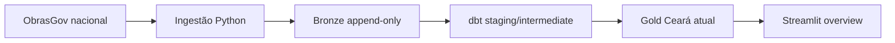

# Plano — SPEC-001

**Status:** Done
**Aprovação humana explícita para Done:** Confirmada pelo usuário em 23/08/2026 ("finalizamos a spec 1")
**Última revisão:** 23/08/2026

## Rastreabilidade

| Requisito | Implementação planejada | Validação |
|---|---|---|
| REQ-001 | `pyproject.toml`, `uv.lock`, Dockerfiles, `compose.yaml`, bootstrap PostgreSQL | build e execução limpa do Compose |
| REQ-002 a REQ-004 | pacote `ingestion/`, full load e tabelas `bronze.ingestion_run`/raw | testes unitários, falha simulada e reconciliação |
| REQ-005 e REQ-006 | `dbt/models/staging`, `intermediate` e `marts` | `dbt build` e reconciliações SQL |
| REQ-007 e REQ-008 | `frontend/streamlit_app.py`, página overview e `frontend/gold.py` | AppTest e smoke test |
| REQ-009 | testes, logs, README e `verification.md` | execução dos comandos documentados |
| REQ-010 | identidade lógica do snapshot, restrições únicas e opção `--force` | testes de repetição, página duplicada e reprocessamento |
| REQ-011 | leitura de `/data-atualizacao` antes e depois da paginação | teste de mudança da fonte durante a carga |
| REQ-012 | retenção integral e views `gold.vw_*_current` | teste com snapshots históricos e execução falha |
| REQ-013 | `docs/DESIGN.md`, layout e tema do Streamlit | renderização e inspeção visual da visão geral |
| REQ-014 | `frontend/pages/overview.py`, filtro de período de cadastro sobre `registration_date` | AppTest, teste unitário de intervalo e smoke test do Streamlit |

## Fluxo de dados

Uma execução recebe um `ingestion_id`. Somente após ingestão e reconciliação completas ela assume `succeeded`; as views atuais selecionam a última execução bem-sucedida.

## Plano por stack afetada

### Fundação e infraestrutura

- Criar configuração Python/uv, variáveis de ambiente de exemplo e ignores.
- Criar PostgreSQL com roles e schemas `bronze`, `silver` e `gold`.
- Coordenar PostgreSQL, ingestão, dbt e Streamlit no Compose.

### Ingestão Python e Bronze

- Implementar cliente HTTP com paginação, timeout e retentativas transitórias limitadas.
- Consultar `/data-atualizacao` antes e depois da carga.
- Ingerir nacionalmente `/projeto-investimento` e `/geometria`.
- Persistir metadados da execução e payloads raw em transações e lotes.
- Reconciliar páginas e total de itens antes de publicar sucesso.
- Criar um snapshot completo por atualização da fonte, sem upsert entre `ingestion_id` distintos.

### dbt Silver/Gold

- Declarar fontes Bronze.
- Tipar, renomear, deduplicar e separar coleções necessárias.
- Publicar dimensões, fatos, bridges e views atuais mínimos para os KPIs.
- Adicionar descrições, testes genéricos, testes singulares e reconciliações.

### Streamlit

- Implementar conexão somente leitura à Gold.
- Criar visão geral com KPIs, filtros e distribuição por situação disponíveis.
- Adicionar período de cadastro relativo ao snapshot: 3, 6, 12 meses e ano corrente.
- Exibir datas da fonte e da ingestão para contextualizar o snapshot.
- Aplicar os tokens e componentes de `docs/DESIGN.md`.
- Aplicar o cabeçalho, a composição e a hierarquia definidas em `docs/DESIGN.md`, sem fixar dados simulados.

### Testes e documentação

- Testar paginação, retentativa, falha, reconciliação e persistência da ingestão.
- Testar modelos dbt e consultas do frontend.
- Documentar execução limpa e registrar evidências reproduzíveis.

## Tratamento de falhas e idempotência

- Falha de qualquer recurso impede status `succeeded`.
- Retentativas atendem somente falhas transitórias e possuem limite explícito.
- Uma execução falha permanece auditável, mas não é consumida pelas views atuais.
- `source_updated_at` e o hash do escopo formam a identidade lógica do snapshot.
- Uma execução normal retorna o snapshot bem-sucedido existente sem recarregá-lo.
- `--force` permite nova ingestão com outro `ingestion_id`.
- Uma nova tentativa após falha usa outro `ingestion_id` e mantém a tentativa anterior.
- Restrições únicas por execução, recurso, página e posição tornam a repetição de páginas idempotente.
- Se `/data-atualizacao` mudar durante a carga, a execução assume `failed`, permanece auditável e uma nova execução integral recebe outro `ingestion_id`.
- Inclusões, alterações e exclusões lógicas são observadas pela comparação entre snapshots completos.
- Não haverá expurgo automático no case; crescimento, particionamento e retenção de produção ficam como melhoria futura.

## Segurança e privacidade

- A fonte é pública, mas credenciais PostgreSQL não são versionadas.
- O frontend recebe apenas `USAGE` e `SELECT` na Gold.
- Containers usam usuário não-root quando suportado.
- Entradas da API são tratadas como dados não confiáveis e não são executadas como código ou SQL.

## Estratégia de testes

- `ruff check` e pytest para ingestão e frontend.
- `dbt build` para modelos, contratos e testes de dados.
- teste de integração do fluxo com PostgreSQL local.
- smoke test do Compose e da página Streamlit.
- inspeção visual da renderização em relação ao `DESIGN.md` e à imagem de referência.
- reconciliação Bronze → Silver → Gold para a ingestão aprovada.

## Decisões abertas

Nenhuma.
