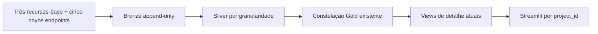

# Plano — SPEC-002

**Status:** Done
**Última revisão:** 23/08/2026

## Rastreabilidade

| Requisito | Implementação | Validação |
|---|---|---|
| REQ-001/REQ-002 | visão geral, `project_detail.py`, navegação e estado por `project_id` | AppTest e smoke test |
| REQ-003/REQ-004 | ingestão, registro dinâmico de recursos e oito tabelas raw | testes de paginação, reconciliação e falha atômica |
| REQ-005 | staging e intermediate por granularidade | `dbt build` e testes singulares |
| REQ-006 a REQ-008 | novos fatos, dimensões/bridges conformadas e ADR aplicável | contratos dbt, relações e testes de fanout |
| REQ-009 a REQ-012 | views Gold atuais, `frontend/gold.py` e página de detalhe | testes de consulta permitida, estados e renderização |
| REQ-013 a REQ-026 | catálogo, reconciliações, fatos relacionados e `verification.md` | execução ponta a ponta, isolamento por projeto e reconciliação das coleções |

## Fluxo de dados

Os novos endpoints integram a mesma execução lógica dos recursos da SPEC-001. A publicação atual ocorre somente quando os oito recursos esperados forem reconciliados; falha em qualquer um preserva integralmente o snapshot atual anterior.

## Plano por stack afetada

### Ingestão Python e Bronze

- Declarar os cinco recursos em um registro único reutilizado pelo pipeline e pela persistência.
- Criar tabelas raw e privilégios seguindo o contrato Bronze existente.
- Substituir a quantidade fixa de recursos por validação baseada no registro configurado.
- Reutilizar paginação, retentativa, hash, reconciliação e detecção de mudança da fonte.
- Medir duração e volume por recurso para registrar o impacto da carga nacional.

### dbt Silver

- Criar staging para contrato, empenho, execução física, histórico e estudo.
- Explodir participantes, PPAs, áreas de restrição, indicadores de foto, indicadores e motivos de execução em modelos separados.
- Documentar chaves naturais, fallbacks determinísticos e colisões observadas.
- Preservar todos os snapshots e aplicar o recorte do case após normalização.

### dbt Gold

- Manter `fct_project_snapshot` como espinha conformada do detalhe, sem duplicar seus atributos em `dim_project` nesta spec.
- Reutilizar dimensões conformadas e criar `dim_supplier` somente para a semântica própria de fornecedor.
- Criar os cinco fatos de detalhe e bridges necessárias.
- Generalizar `dim_organization` para os quatro papéis e criar as bridges de participante, PPA, área de restrição e indicador de foto.
- Preservar `ingestion_id` em todos os fatos, mantendo snapshots anteriores para auditoria sem usá-los nas timelines da página atual.
- Manter todos os IDs em `fct_status_event` e agrupar a chave semântica somente na view de consumo, com contagem e IDs associados.
- Publicar uma view de cabeçalho e views separadas por coleção.
- Criar `vw_project_coverage_current` a partir de contagens por fato, sem join multiplicativo.
- Publicar os totais de empenho por medida em agregação própria e manter a coleção individual em view separada.
- Atualizar `docs/modelagem-dados.md`, catálogo dbt e ADR 0002 conforme a decisão final.

### Streamlit

- Abrir o detalhe pelo `project_id` público persistido na URL e oferecer seletor alternativo que atualiza o mesmo parâmetro.
- Consultar cada bloco sob demanda por SQL parametrizado.
- Restringir todas as consultas ao `ingestion_id` da última execução integral com status `succeeded`.
- Restringir todas as coleções ao único `project_id` selecionado e listar todos os contratos distintos dessa obra.
- Exibir todos os municípios e pins associados, mantendo na lista as localizações sem coordenada e sem escolher município principal.
- Mostrar o total de investimento previsto e a abertura por fonte, sem misturar contratos ou empenhos.
- Agrupar responsável, repassadores, tomadores e executores por papel, sem fundir papéis da mesma organização.
- Exibir todas as classificações, PPAs e áreas de restrição; tratar foto somente como indicador de disponibilidade.
- Exibir atributos descritivos do projeto e separar datas previstas de efetivas, sem inferir atraso.
- Sinalizar divergência entre indicadores declaratórios e coleções relacionadas sem sobrescrever a fonte.
- Mostrar a contagem e a tabela completa de contratos, com expansão individual e medidas contratuais separadas.
- Mostrar quantidade, tipo e especificação dos estudos, sem campos não fornecidos pelo endpoint.
- Renderizar cabeçalho, resumo e seções na ordem definida pela spec.
- Apresentar os registros vigentes de execução física, deduplicados dentro do snapshot, sem criar timeline de medições.
- Renderizar um card por `id_execucao_fisica` distinto, sem agregar percentuais entre registros.
- Apresentar `Histórico de cancelamento e paralisação` somente com eventos do endpoint específico, sem derivá-lo da execução física.
- Mostrar os 10 grupos semânticos mais recentes e permitir expandir o histórico completo.
- Mostrar os totais separados de empenho e o agrupamento visual das quatro medidas de restos a pagar, com tabela individual expansível.
- Não consultar snapshots anteriores nem apresentar tendências reconstruídas entre ingestões.
- Implementar estados de cobertura, ausência e erro por bloco sem ocultar o restante da página.
- Manter todas as linhas das coleções com ordenação determinística, usando rolagem ou expansão para volumes maiores.
- Tornar links externos clicáveis somente após validação de esquema `http` ou `https`.

### Testes e documentação

- Amostrar projetos reais com cobertura positiva e negativa em cada recurso.
- Testar navegação, URL inválida, estados, temas e responsividade.
- Reconciliar Bronze, Silver e Gold para as amostras e para as contagens globais do recorte.
- Registrar comandos, tempos, resultados e limitações em `verification.md`.

## Tratamento de falhas e idempotência

- Qualquer recurso incompleto impede `succeeded` para toda a ingestão.
- Repetir o mesmo snapshot mantém a idempotência da SPEC-001; `--force` gera outro `ingestion_id`.
- Erro de uma seção do frontend identifica a ingestão e não expõe credenciais.
- Um projeto sem associação produz estado vazio, não erro e não linha sintética.

## Segurança e privacidade

- O frontend mantém acesso somente leitura ao schema Gold.
- `project_id` é enviado como parâmetro, nunca interpolado no SQL.
- Dados públicos não eliminam o dever de mascarar credenciais e mensagens internas de erro.
- Valores de URL não validados nunca são renderizados como links executáveis.

## Estratégia de testes

- Ruff e pytest para ingestão e frontend.
- `dbt build` para modelos, contratos e testes de dados.
- Testes singulares de reconciliação, órfãos, colisão e fanout.
- AppTest para navegação e estados da página.
- Smoke test do Compose e inspeção visual da página completa.

## Decisões fechadas

- Chaves, campos e granularidades foram confirmados com payloads reais dos cinco novos endpoints e contratos dbt.
- A revisão final foi aprovada e a spec está em `Done` desde 23/08/2026.
