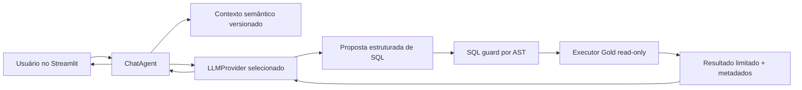

# Plano — SPEC-003

**Status:** Done
**Última revisão:** 23/08/2026

## Rastreabilidade

| Requisito | Implementação planejada | Validação |
|---|---|---|
| REQ-001/REQ-015 | `frontend/pages/analytical_chat.py`, `frontend/streamlit_app.py` e `st.session_state` | AppTest e smoke tests das três páginas |
| REQ-002/REQ-007/REQ-012 | `frontend/analytical_chat/agent.py` e contratos de resultado | provider fake, testes de ordem, recusa e grounding |
| REQ-003 | `frontend/analytical_chat/providers/base.py` e factory configurável | testes de seleção e configuração inválida |
| REQ-004 | `frontend/analytical_chat/providers/gemini.py` | cliente mockado, timeout e erro sanitizado |
| REQ-005 | `frontend/analytical_chat/providers/base.py` e factory, sem runtime Codex nesta fase | contrato de extensão, rejeição de `codex_cli` e inspeção da ausência no Compose |
| REQ-006/REQ-011 | `frontend/analytical_chat/context.py`, contratos dbt e `frontend/gold.py` | testes de drift, perguntas douradas e fanout |
| REQ-008/REQ-009/REQ-014 | `frontend/analytical_chat/sql_guard.py` | matriz de SQL válido, proibido e adversarial |
| REQ-010/REQ-013/REQ-016 | executor Psycopg dedicado em `frontend/gold.py` e role `obrasgov_chat` | grants, transação read-only, rollback, timeout e limites |
| REQ-017 | testes em `tests/frontend/` | Ruff, pytest e AppTest sem rede |
| REQ-018 | PRD, arquitetura, ADR 0003, DESIGN, README, `.env.example`, Compose e dependências | revisão documental, `uv lock --check` e smoke test |

## Fluxo de dados

O provider produz texto ou envelope estruturado, mas não recebe conexão, callable de banco, shell do aplicativo ou ferramenta de execução SQL. Apenas o `ChatAgent` pode encaminhar SQL aprovado ao executor Gold.

## Plano por stack afetada

### Governança e arquitetura — pré-Ready

- Atualizar `docs/PRD.md` para incluir a POC e manter explícito que não há decisão comercial automática.
- Criar `docs/adr/0003-chat-analitico-llm-e-sql-seguro.md` para registrar o seam de providers, o fluxo de duas chamadas, o guard AST e a decisão Gemini-first; o isolamento do Codex CLI fica como gate de uma futura extensão.
- Atualizar `docs/arquitetura.md` com `frontend/analytical_chat/`, mantendo Gold como único seam de dados.
- Atualizar `docs/DESIGN.md` com página de chat, estados e linguagem executiva; SQL e metadados técnicos permanecem internos.
- Não alterar `CONTEXT.md` nem modelos dbt na primeira versão, salvo descoberta material registrada antes na spec.
- Concluir PRD e ADR antes de solicitar a transição da spec para `Ready`.

### Dependências e configuração

- Adicionar `google-genai` e `sqlglot` ao extra `frontend`, com versões fixadas e lock atualizado.
- Documentar `ANALYTICAL_CHAT_ENABLED=false`, `LLM_PROVIDER=gemini`, `GEMINI_API_KEY`, `GEMINI_MODEL=gemini-3.5-flash-lite`, timeouts e limites em `.env.example`, sem valor real. Não criar telemetria ou monitoramento de tokens.
- Passar ao container frontend apenas as configurações necessárias ao provider Gemini selecionado.

### Providers de LLM

- Definir `LLMProvider` com operação pequena de geração e erros próprios sanitizados.
- Criar factory que reconhece `gemini` e o fake injetado pelos testes; `codex_cli` permanece reservado e falha fechado.
- Implementar Gemini com cliente oficial, modelo configurável, timeout e resposta validada.
- Manter o contrato de provider e a factory desacoplados do SDK Gemini para permitir um futuro adapter Codex CLI sem alterar o `ChatAgent`.
- Não instalar Codex CLI nem montar autenticação no container frontend; qualquer implementação futura exigirá spec e gate de isolamento próprios.

### Contexto semântico e agente

- Catalogar todas as views Gold públicas usadas pela visão geral e pelo detalhe, os subconjuntos de colunas geráveis e suas granularidades com referência aos modelos/YAML dbt e ao glossário.
- Manter a view de metadados limitada às colunas públicas; excluir `ingestion_id` do contexto analítico e do resultado enviado ao provider.
- Incluir regras explícitas para `source_updated_at`, situação original, datas, investimento, municípios e fanout.
- Delimitar pergunta e linhas de resultado como dados não confiáveis no prompt.
- Propagar somente os últimos turnos naturais da sessão para resolver referências conversacionais, sem transportar SQL, resultado bruto ou metadados internos.
- Fazer a primeira chamada produzir decisão de answerability e SQL em envelope estruturado.
- Executar no máximo uma consulta por pergunta nesta POC.
- Fazer a segunda chamada receber apenas a pergunta, contexto necessário, metadados e resultado limitado.
- Exigir resposta de insuficiência quando a pergunta pedir dados da SPEC-002 ou inferências não sustentadas.

### SQL guard e acesso Gold

- Executar spike pré-Ready de `sqlglot` para PostgreSQL, aliases, CTEs, locks, funções, schema qualification e falha fechada.
- Analisar SQL com `sqlglot` no dialeto PostgreSQL e exigir uma única árvore de consulta.
- Rejeitar qualquer nó de escrita, controle, cópia, lock, `SELECT INTO`, wildcard ou referência externa.
- Permitir relações Gold allowlisted e joins seguros por `project_id`, rejeitando `WITH RECURSIVE`, `CROSS JOIN`, `LATERAL`, funções de tabela, fanout não pré-agregado e relações incompatíveis.
- Resolver aliases/CTEs e validar relações físicas somente contra a allowlist Gold.
- Validar colunas por view e funções por lista mínima, sem confiar apenas no prefixo `SELECT`.
- Impor máximos de caracteres SQL, profundidade, nós AST, CTEs e subconsultas.
- Aplicar gramática semântica por view: bloquear medida financeira na localização e permitir ranking municipal somente por obras distintas.
- Criar role `obrasgov_chat` com `USAGE` apenas em Gold, `SELECT` nas 17 views geráveis e somente colunas públicas na view estática de metadados.
- Executar com Psycopg dedicado, transação read-only, `search_path` fixo, `SET LOCAL statement_timeout`, cursor `N + 1`, limites por célula/colunas/bytes e rollback obrigatório.
- Consultar metadados por SQL estático do adaptador, não pelo SQL gerado.
- Não cachear globalmente perguntas ou respostas; avaliar apenas cache dos contratos estáticos.

### Streamlit

- Adicionar terceira página à navegação atual com título `Chat com os dados`.
- Usar `st.chat_message`, `st.chat_input`, spinner e `st.session_state`.
- Manter a página desabilitada por padrão, sem checkbox ou banner técnico.
- Exibir somente resposta executiva e CTA para o detalhe quando o resultado identificar uma única obra.
- Diferenciar chat indisponível, fora do domínio, provider indisponível, SQL rejeitado, timeout, Gold indisponível e resultado vazio.
- Preservar os estilos e estados de `docs/DESIGN.md` sem duplicar regras de KPI na página.

### Testes e documentação

- Criar provider fake determinístico para o fluxo completo sem rede.
- Testar o adapter Gemini com cliente mockado e a rejeição segura de providers não suportados.
- Criar corpus de SQL permitido e proibido, incluindo prompt injection e CTEs adversariais.
- Criar perguntas douradas com medida explícita e SQL de referência: municípios por quantidade de obras; organizações por quantidade e por investimento; recusar investimento por município.
- Reconciliar perguntas douradas com a Gold real sob o mesmo snapshot.
- Reconciliar a pergunta dourada de obras ativas com execução física acima de percentual, usando `Em execução`, `physical_execution_percentage` e `project_id` distinto.
- Executar AppTest para chat normal, recusa, vazio e falhas.
- Reexecutar testes dbt atuais; `dbt build` completo só é obrigatório se algum contrato Gold mudar.
- Atualizar README com configuração local, limites, segurança e ausência de suporte de produção.

## Tratamento de falhas e idempotência

- Cada pergunta executa no máximo uma tentativa de SQL; a POC não corrige SQL iterativamente de forma autônoma.
- Falha em qualquer etapa encerra a pergunta e não chama etapas posteriores.
- Timeout do provider Gemini encerra a chamada e retorna erro seguro.
- Timeout ou cancelamento do PostgreSQL encerra a transação sem efeito persistente.
- Resposta fora do envelope esperado é inválida e não é interpretada por heurística permissiva.
- O histórico da sessão registra somente mensagens apresentáveis, sem stack trace, credencial ou payload bruto.
- Repetir a mesma pergunta pode gerar nova chamada; cache de resposta e deduplicação ficam fora da POC.

## Segurança e privacidade

- O banco continua sendo a fronteira final: role dedicada sem escrita, somente views Gold públicas allowlisted e transação read-only.
- O parser AST, a allowlist de objetos/colunas/funções e os limites são controles independentes do prompt.
- O SQL do LLM nunca é executado antes de todos os guardrails.
- O provider recebe apenas o contexto semântico necessário; não recebe schema discovery, conexão ou credenciais.
- O seam de provider não concede ao LLM conexão, shell, ferramentas ou acesso ao repositório; uma futura extensão Codex CLI deverá adicionar isolamento próprio antes de qualquer habilitação.
- Pergunta e dados Gold são delimitados como conteúdo não confiável; instruções encontradas nesses campos não criam nova ação.
- Logs registram categoria da falha, provider e duração, sem prompt integral, resultado integral, SQL com dado sensível ou secrets.
- Nenhuma credencial entra no Git; testes usam valores fictícios e doubles.
- A transferência ao provider é aceita para o recorte Gold público e limitado; a UI não expõe aviso técnico persistente, o app não retém prompts/resultados fora da sessão e secrets/metadados internos permanecem excluídos.

## Estratégia de testes

- Unitários: catálogo semântico, factory, envelopes, SQL guard, limites e serialização.
- Spikes pré-Ready: compatibilidade do parser e limites de complexidade em PostgreSQL.
- Providers: cliente Gemini mockado e rejeição segura de provider não suportado, incluindo indisponibilidade e timeout.
- Agente: fluxo feliz, recusa, falhas por etapa, grounding e prompt injection.
- Gold: transação read-only, privilégios, timeout, allowlist e limites em PostgreSQL local.
- Semântica: perguntas douradas reconciliadas contra SQL de referência e teste específico de fanout.
- Streamlit: AppTest da página de chat e regressão das páginas existentes.
- Projeto: Ruff, pytest, lockfile, Compose e smoke test; dbt build quando aplicável.

## Decisões abertas

- Nenhuma decisão material permanece para solicitar `Ready`; a implementação deverá validar os contratos e limites já definidos.
